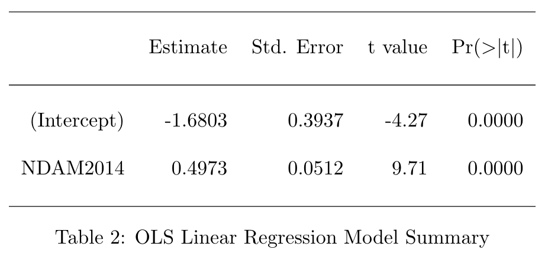

```{r, setup, include=FALSE}
library(mdsr)   
library(ggplot2)
library(mosaic)
library(knitr)
library(tidyverse)
library(dplyr)
library(GGally)
library(kableExtra)
library(DAAG)
library(Rfit)
library(leaps)
library(gam)
library(xtable)
# Load additional packages here 
knitr::opts_chunk$set(
  tidy=FALSE,     # display code as typed
  size="small")   # slightly smaller font for code
```

```{r, include=FALSE}
# load in full dataset
full_hurricane_df <- hurricNamed
glimpse(full_hurricane_df)

# remove non numeric and BaseDamage for ggpairs call
hurricane_numeric <- full_hurricane_df %>% 
  select(-c(Name, AffectedStates, firstLF, mf, BaseDamage, Year))

# removing death outlier
hurricane_death_outlier <- hurricane_numeric %>% 
  filter(deaths != 1836)

# applying a log transformation to deaths
hurricane_logdeaths <- hurricane_numeric %>% 
  mutate(log_deaths = ifelse(deaths == 0, 0, log(deaths))) %>% 
  mutate(NDAM2014 = log(NDAM2014)) %>% 
  mutate(BaseDam2014 = log(BaseDam2014)) %>% 
  select(-deaths)
```

## Purpose

- To predict the log number of hurricane deaths based on variables such as maximum sustained windspeed, atmospheric pressure, and property damage from a dataset containing data on 94 named hurricanes that made landfall in the US mainland from 1950 through 2012. 
- We hypothesized that the number of deaths would increase with an increase in maximum sus- tained windspeed and property damage, as intuitively it would make sense for more destructive hurricanes to also be more deadly.

# Data

## Source

- Dataset "hurricNamed" from the "DAAG" R package containing data on 94 named hurricanes that made landfall in the US mainland from 1950 through 2012. 
- Contains information on the number of deaths, the name of the hurricane, the year of the hurricane, the damage caused by the hurricane, etc.
- Data was sourced from multiple places and were used in a research paper claiming that hurricanes with female names did more human damage (after adjusting for the severity of the storm) than those with male names.

## Response Variable

Our response variable is the log number of deaths that occurred due to a hurricane. The units are number of human deaths. We observe that the range of deaths are from 0 to 1836. 

## Explanatory Variables

 - LF.WindsMPH describes the maximum sustained windspeed for each hurricane in miles per hour
 - LF.PressureMB describes the atmospheric pressure at landfall in millibars
 - LF.times describes the number of times the hurricane made landfall 
 - BaseDam2014 describes the property damage caused by the hurricane in millions of 2014 US dollars
 - NDAM2014 describes the amount of damage the hurricane caused had it appeared in 2014 (no units given)
 - deaths describes the number of human deaths the hurricane caused

# Exploratory Analysis

## Kernel Density Estimation
- Found that  `deaths`, `NDAM2014`, and `BaseDam2014` had very non-normal/skewed kernel density estimates. 
- Adding a `log()` transformation to `deaths`, `NDAM2014`, and `BaseDam2014` resulted in more normal kernel density estimates and minimized the effects of the outliers. (The application of a log transformation allows the researchers to fit linear regression models (OLS and JHM) to the data.) A few of the afforementioned KDEs can be seen below:

---
```{r, fig.height = 4, warning = FALSE, include=FALSE}

p1 <- ggplot(data = hurricane_logdeaths, 
                         aes(x = hurricane_numeric$deaths)) +
                    geom_density(bw = "bcv", kernel = "epanechnikov", size = 0.3, 
                                 color = "royalblue") +
                    ggtitle("Epanechnikov, BCV") +
                    xlab("deaths")


p2 <- ggplot(data = hurricane_logdeaths, 
                         aes(x = hurricane_logdeaths$log_deaths)) +
                    geom_density(bw = "bcv", kernel = "epanechnikov", size = 0.3, 
                                 color = "royalblue") +
                    ggtitle("Epanechnikov, BCV") +
                    xlab("log_deaths")

p3 <- ggplot(data = hurricane_logdeaths, 
                         aes(x = hurricane_numeric$NDAM2014)) +
                    geom_density(bw = "bcv", kernel = "epanechnikov", size = 0.3, 
                                 color = "royalblue") +
                    ggtitle("Epanechnikov, BCV") +
                    xlab("NDAM2014")

p4 <- ggplot(data = hurricane_logdeaths, 
                         aes(x = hurricane_logdeaths$NDAM2014)) +
                    geom_density(bw = "bcv", kernel = "epanechnikov", size = 0.3, 
                                 color = "royalblue") +
                    ggtitle("Epanechnikov, BCV") +
                    xlab("log_NDAM2014")

grid1 <- cowplot::plot_grid(p1, p2, nrow = 1)
grid2 <- cowplot::plot_grid(p3, p4, nrow = 1)

```

```{r echo= FALSE}
plot(grid1)
```

---
```{r echo= FALSE}
plot(grid2)
```

## KDE Findings
- For `log_deaths`, the rectangular kernel overfits and the bandwidth selected by UCV is similarly unsuitable. 
- The gaussian kernel looks appears to be oversmoothing. 
- The triangular and epanechnikov kernels are similar, 
- Decided to go with th epanechnikov kernel with bandwidth selected using BCV. The KDE looks fairly reasonable overall, and epanechnikov is generally a good choice of kernel. 

## Correlation Tests
> - We use Kendall's $\tau$ at a significance level $\alpha=0.05$, as it is robust against outliers.
> - Hypotheses tested:
> - The null hypothesis of no association (independence) $H_0: \tau \leq 0$ 
> - The alternative hypothesis of positive association $H_A: \tau > 0$. 
> - (They also tested for negative associations with the set of hypotheses $H_0: \tau \geq 0$ and $H_A: \tau < 0$.)

## Correlation Results
- log_NDAM2014, log_BaseDam2014, LF.times, and LF.WindsMPH were all significantly positively associated with log_deaths. 
- LF.PressureMB was also significantly negatively associated with log_deaths.

## Correlation Table

```{r, out.width = '700px', fig.align = 'center', echo = FALSE}

knitr::include_graphics('./Correlation.png')
```


## Ordinary Least Squares Regression
> - Carried out best subsets selection method and series of nested F tests
> - Assumptions for OLS: 
>- Independence was reasonably assumed
>- Linearity & Equal Variances condition was analyzed by the residual plot vs the fitted values exhibited a fan shape, which indicated unequal variances, but we proceeded with caution.
> - The best OLS model was the model predicting log_deaths with simply log_NDAM2014 (normalized damage)
> - This was a good model, with a relatively low AIC (301.11), and also a moderately high adjusted R2 of 50.08%.

## OLS Linear Regression Model

```{r, echo = FALSE, out.width = '600px', fig.align = 'center'}



```

\begin{table}[ht]
\centering
\begin{tabular}{rrrrr}
  \hline
 & Estimate & Std. Error & t value & Pr($>$$|$t$|$) \\ 
  \hline
(Intercept) & -1.6803 & 0.3937 & -4.27 & 0.0000 \\ 
  NDAM2014 & 0.4973 & 0.0512 & 9.71 & 0.0000 \\ 
   \hline
\end{tabular}
\end{table}

## Kolmogrov Smirnov Test
- Ran this test to check the assumption of normally distributed residuals for our above selected linear regression model.
- Hypothesis: $H_0: F(t) = F^*(t)$ & $H_A: F(t) \neq F^*(t)$ for at least one $t$
Where $F(t)$ refers to the estimated CDF of the distribution of residuals of our linear model, and $F^*(t)$ is the CDF of the normal distribution.

## Assumptions: 
> - Continuous: The test assumes that the theoretical distribution is continuous, which is reasonable.
> - Independence: This is reasonable, as there's no reason to believe the log deaths for one hurricane would affect another.
> - Parameters: This is also satisfied, we have mean = 0, and sd = 1 for the normal distribution, and neither of these is estimated. 
> - With the assumptions met, we ran the Kolmogrov Smirnov Test

## Kolmogrov Smirnov Test Results
> - We have a $p-$value of $0.7095 > 0.05$, so we fail to reject the null hypothesis at our significance level. 
> - We conclude that there is insufficient evidence to suggest that the estimated CDF of the distribution of the residuals in our linear model is significantly different to the CDF of the normal distribution. Thus, our assumptions for our linear model are met. 

## Rank-based JHM Model
- Fit due to the issue with the equal variances condition in the ordinary least squares regression model
- Since this is a nonparametric procedure, it is more robust than the ordinary least squares estimation, holding up better when conditions such as equal variances are not satisfied.
- Performed drop in dispersion tests to ensure the significance of each predic- tor in the model, after accounting for the effects of others.
- Found that the best model predicting log_deaths was again one that used only log_NDAM2014. 

## JHM Model Findings
- Resulted in a single predictor model, with the same predictor - logarithmically transformed ‘NDAM2014’ as in the OLS linear regression model. 
- Multiple R2 of 48.07%, which was decent

# Generalized Additive Model

```{r, include=FALSE}
m0 <- gam(log_deaths ~ NDAM2014, data = hurricane_logdeaths) # NDAM2014 linear

# bsplines with varying df
# m1 is best
m1 <- gam(log_deaths ~ bs(NDAM2014), data = hurricane_logdeaths)
m2 <- gam(log_deaths ~ bs(NDAM2014, df = 2), data = hurricane_logdeaths)
m3 <- gam(log_deaths ~ bs(NDAM2014, df = 3), data = hurricane_logdeaths)
m4 <- gam(log_deaths ~ bs(NDAM2014, df = 4), data = hurricane_logdeaths)
m5 <- gam(log_deaths ~ bs(NDAM2014, df = 5), data = hurricane_logdeaths)
m6 <- gam(log_deaths ~ bs(NDAM2014, df = 6), data = hurricane_logdeaths)

# smoothing splines with varying df arguments (smoothing parameter)
m7 <- gam(log_deaths ~ s(NDAM2014), data = hurricane_logdeaths)
m8 <- gam(log_deaths ~ s(NDAM2014, df = 4), data = hurricane_logdeaths)
m9 <- gam(log_deaths ~ s(NDAM2014, df = 5), data = hurricane_logdeaths)
m10 <- gam(log_deaths ~ s(NDAM2014, df = 6), data = hurricane_logdeaths)
m11 <- gam(log_deaths ~ s(NDAM2014, df = 7), data = hurricane_logdeaths)
m12 <- gam(log_deaths ~ s(NDAM2014, df = 8), data = hurricane_logdeaths)

AIC(m0, m1, m2, m3, m4, m5, m6, m7, m8, m9, m10, m11, m12)

# LF.PressureMB absent
m0 <- gam(log_deaths ~ bs(NDAM2014), data = hurricane_logdeaths)

m1 <- gam(log_deaths ~ bs(NDAM2014) + LF.PressureMB, 
          data = hurricane_logdeaths) # LF.PressureMB linearly included

# bsplines with varying df
m2 <- gam(log_deaths ~ bs(NDAM2014) + bs(LF.PressureMB), 
          data = hurricane_logdeaths)
m3 <- gam(log_deaths ~ bs(NDAM2014) + bs(LF.PressureMB, df = 3), 
          data = hurricane_logdeaths)
m4 <- gam(log_deaths ~ bs(NDAM2014) + bs(LF.PressureMB, df = 4), 
          data = hurricane_logdeaths)
m5 <- gam(log_deaths ~ bs(NDAM2014) + bs(LF.PressureMB, df = 5), 
          data = hurricane_logdeaths)
m6 <- gam(log_deaths ~ bs(NDAM2014) + bs(LF.PressureMB, df = 6), 
          data = hurricane_logdeaths)
m7 <- gam(log_deaths ~ bs(NDAM2014) + bs(LF.PressureMB, df = 7), 
          data = hurricane_logdeaths)

# smoothing splines with varying df arguments (smoothing parameter)
m8 <- gam(log_deaths ~ bs(NDAM2014) + s(LF.PressureMB), 
          data = hurricane_logdeaths)
m9 <- gam(log_deaths ~ bs(NDAM2014) + s(LF.PressureMB, df = 4), 
          data = hurricane_logdeaths)
# m 10 is best 
m10 <- gam(log_deaths ~ bs(NDAM2014) + s(LF.PressureMB, df = 5), 
           data = hurricane_logdeaths)
m11 <- gam(log_deaths ~ bs(NDAM2014) + s(LF.PressureMB, df = 6), 
           data = hurricane_logdeaths)
m12 <- gam(log_deaths ~ bs(NDAM2014) + s(LF.PressureMB, df = 7), 
           data = hurricane_logdeaths)
m13 <- gam(log_deaths ~ bs(NDAM2014) + s(LF.PressureMB, df = 3), 
           data = hurricane_logdeaths)

AIC(m0, m1, m2, m3, m4, m5, m6, m7, m8, m9, m10, m11, m12, m13)

# actual final gam
final_gam <- gam(log_deaths ~ bs(NDAM2014) + poly(LF.PressureMB, 3), 
          data = hurricane_logdeaths)
#summary(final_gam)
final_gam_df <- data.frame(predict(final_gam, type="terms"))
colnames(final_gam_df) <- c("NDAM_pred", "pressure_pred")

ybar <- mean(hurricane_logdeaths$log_deaths)
mean_adj_smooth <- predict(final_gam, type="terms") + ybar
colnames(mean_adj_smooth) <- c("NDAM_mean_adj", "pressure_mean_adj")
mean_adj_smooth <- cbind.data.frame(mean_adj_smooth, hurricane_logdeaths)

NDAM_gam <- gam(log_deaths ~ bs(NDAM2014), data = hurricane_logdeaths)
#NDAM_gam <- gam(log_deaths ~ s(NDAM2014, df = 7), data = hurricane_logdeaths)

NDAM_df <- data.frame(pred_NDAM = predict(NDAM_gam, hurricane_logdeaths), 
                      NDAM2014 = hurricane_logdeaths$NDAM2014)

#pressure_gam <- gam(log_deaths ~ s(LF.PressureMB, df=5), data = hurricane_logdeaths)
pressure_gam <- gam(log_deaths ~ poly(LF.PressureMB, 3), data = hurricane_logdeaths)
#pressure_gam <- gam(log_deaths ~ bs(LF.PressureMB, df=6), data = hurricane_logdeaths)
pressure_df <- data.frame(pred_pressure = predict(pressure_gam, hurricane_logdeaths), 
                      pressure = hurricane_logdeaths$LF.PressureMB)

NDAM_plot <- ggplot(data = hurricane_logdeaths, aes(x=NDAM2014, y=log_deaths)) +
  geom_point() +
  geom_line(inherit.aes = FALSE, data=NDAM_df,
            aes(x=NDAM2014, y=pred_NDAM), color = "red") +
  geom_hline(yintercept = ybar, linetype = 2, color = "blue") +
  geom_line(inherit.aes = FALSE, data=mean_adj_smooth,
            aes(x=NDAM2014, y=NDAM_mean_adj), color="gold")

pressure_plot <- ggplot(data = hurricane_logdeaths, aes(x=LF.PressureMB, y=log_deaths)) +
  geom_point() +
  geom_line(inherit.aes = FALSE, data=pressure_df,
            aes(x=pressure, y=pred_pressure), color = "red") +
  geom_hline(yintercept = ybar, linetype = 2, color = "blue") +
  geom_line(inherit.aes = FALSE, data=mean_adj_smooth,
            aes(x=LF.PressureMB, y=pressure_mean_adj), color="gold")

hurricane_ols <- lm(log_deaths ~ NDAM2014 + LF.PressureMB, data=hurricane_logdeaths)

residual_plot <- ggplot(final_gam) + 
  geom_point(aes(x=.fitted, y=.resid)) +
  labs(x = "log_deaths", y = "GAM Residuals")


#GAMmod <- gridExtra::grid.arrange(NDAM_plot, pressure_plot, residual_plot, ncol=2)
```

## Fitting log_NDAM2014 & LF.PressureMB to the GAM
- GAM used to look for possible trends and relationships in the data our previous two models might have missed, being restricted by linearity.
- Used manual forward selection to fit the best model. 
- With an AIC of 290.8135, the researchers first found the best way to fit log_NDAM2014 was with a b-spline with the default number of degrees of freedom. 
- The best way to fit LF.PressureMB was with an s-spline with 5 degrees of freedom (while keeping the previous b-spline for log_NDAM2014).

## Additional Changes to the GAM
> - All other predictors increased the AIC, so the researchers decided on the GAM using a b-spline with the default number of degrees of freedom for log_NDAM2014, and an s-spline with 5 degrees of freedom LF.PressureMB. 
> - After plotting, the LF.PressureMB scatterplot displayed a poor fit. 
> - LF.PressureMB appeared to be roughly quadratic, so it was fit with a polynomial.

## Final GAM Model
```{r, echo = FALSE}
#plot(GAMmod)
cowplot::plot_grid(NDAM_plot, pressure_plot, residual_plot, ncol = 2)
```

# Conclusion
## Findings
- The best way to predict the log number of deaths from a US hurricane that made landfall between $1950$ and $2012$ was to use a GAM using a b-spline with the default degrees of freedom on log 'NDAM2014', and a cubic polynomial for 'LF.PressureMB' (AIC = 290.88)
- Matches our original hypothesis because we intuitively expect the number of deaths to increase as the severity (in this case the amount of hurricane damage) increases. 
-We chose the GAM as our final model over the linear and rank based models due to the its lower AIC, its better graphical representation, and its ability to fit to local trends (since our predictors did not appear to be globally linear).

## Limitations
- Shortcomings of the dataset, reliance on normalized metrics, and the numerous log transformations performed. 
- Limited numerical data available for each hurricane. 
- Small number of total numeric predictors (six); only two were related to the actual weather data of the hurricane (windspeed and pressure). 
- More accessible predictors may help with obtaining a more accurate model predicting the log number of deaths.
- Any potential inaccuracies with the normalized metric for our variable, hurricane damage, would mean inaccuracies in our report.
- Relied heavily on the log transformations performed on numerous predictors throughout our report 
- Did not find the best possible log transformation for each predictor.  


# Questions?

