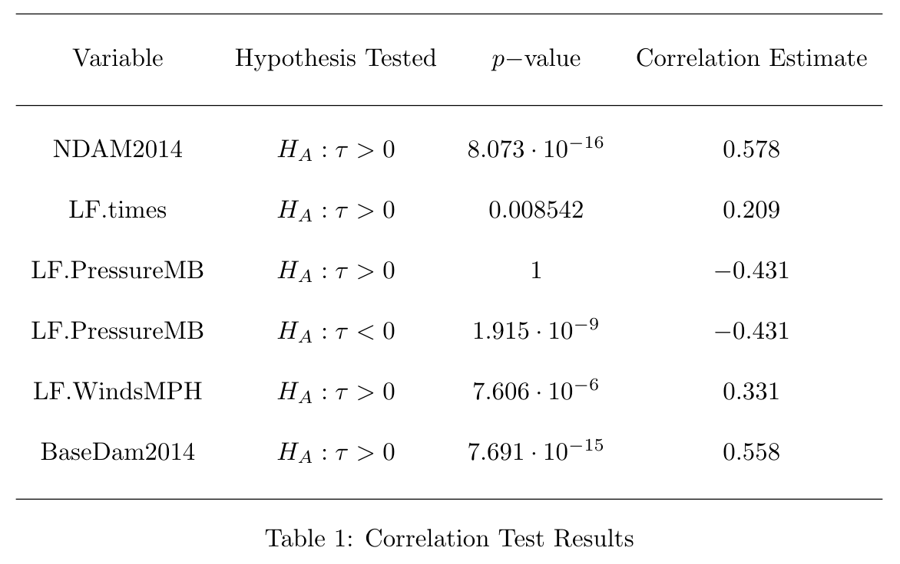

```{r, setup, include=FALSE}
library(mdsr)   
library(ggplot2)
library(mosaic)
library(knitr)
library(tidyverse)
library(dplyr)
library(GGally)
library(kableExtra)
library(DAAG)
library(Rfit)
library(leaps)
library(gam)
library(xtable)
# Load additional packages here 
knitr::opts_chunk$set(
  tidy=FALSE,     # display code as typed
  size="small")   # slightly smaller font for code
```

```{r, include=FALSE}
# load in full dataset
full_hurricane_df <- hurricNamed
glimpse(full_hurricane_df)

# remove non numeric and BaseDamage for ggpairs call
hurricane_numeric <- full_hurricane_df %>% 
  select(-c(Name, AffectedStates, firstLF, mf, BaseDamage, Year))

# removing death outlier
hurricane_death_outlier <- hurricane_numeric %>% 
  filter(deaths != 1836)

# applying a log transformation to deaths
hurricane_logdeaths <- hurricane_numeric %>% 
  mutate(log_deaths = ifelse(deaths == 0, 0, log(deaths))) %>% 
  mutate(NDAM2014 = log(NDAM2014)) %>% 
  mutate(BaseDam2014 = log(BaseDam2014)) %>% 
  select(-deaths)
```

## Purpose

- To predict the number of hurricane deaths based on variables such as maximum sustained windspeed, atmospheric pressure, and property damage 
- Hypothesis:
    - The number of deaths would *increase* with an increase in maximum sustained windspeed and property damage.
    - Intuitively it would make sense for more destructive hurricanes to also be more deadly.

# Data

## Source

- Dataset "hurricNamed" from the "DAAG" R package 
    - 94 named US hurricanes from 1950 to 2012
    - Includes: number of deaths, damage, weather statistics
    - Cited by a research paper


## Variables:

**Response Variable**

  - `deaths` describes the number of human deaths that occured due to each hurricane (ranging from 0 to 1846). 

**Explanatory Variables**

  - `LF.WindsMPH`: max windspeed (mph)
  - `LF.PressureMB`: atmospheric pressure (millibars)
  - `LF.times`: number of times the hurricane made landfall 
  - `BaseDam2014`: property damage (millions of 2014 US dollars)
  - `NDAM2014`: normalized damage (no units given)

# Exploratory Analysis

## Kernel Density Estimation
- `deaths`, `NDAM2014`, and `BaseDam2014` had very skewed kernel density estimates.
- Adding a `log()` transformation to `deaths`, `NDAM2014`, and `BaseDam2014` resulted in more normal kernel density estimates and minimized the effects of the outliers.

---
```{r, fig.height = 4, warning = FALSE, include=FALSE}

p1 <- ggplot(data = hurricane_logdeaths, 
                         aes(x = hurricane_numeric$deaths)) +
                    geom_density(bw = "bcv", kernel = "epanechnikov", size = 0.3, 
                                 color = "royalblue") +
                    ggtitle("Epanechnikov, BCV") +
                    xlab("deaths")


p2 <- ggplot(data = hurricane_logdeaths, 
                         aes(x = hurricane_logdeaths$log_deaths)) +
                    geom_density(bw = "bcv", kernel = "epanechnikov", size = 0.3, 
                                 color = "royalblue") +
                    ggtitle("Epanechnikov, BCV") +
                    xlab("log_deaths")

p3 <- ggplot(data = hurricane_logdeaths, 
                         aes(x = hurricane_numeric$NDAM2014)) +
                    geom_density(bw = "bcv", kernel = "epanechnikov", size = 0.3, 
                                 color = "royalblue") +
                    ggtitle("Epanechnikov, BCV") +
                    xlab("NDAM2014")

p4 <- ggplot(data = hurricane_logdeaths, 
                         aes(x = hurricane_logdeaths$NDAM2014)) +
                    geom_density(bw = "bcv", kernel = "epanechnikov", size = 0.3, 
                                 color = "royalblue") +
                    ggtitle("Epanechnikov, BCV") +
                    xlab("log_NDAM2014")

```

```{r echo= FALSE, fig.height= 5, warning = FALSE}

cowplot::plot_grid(p1, p2, p3, p4, nrow = 2)

```


## Correlation Tests
- We use Kendall's $\tau$ at a significance level $\alpha=0.05$
- Hypotheses tested:
    - The null hypothesis of no association (independence) $H_0: \tau \leq 0$ 
    - The alternative hypothesis of positive association $H_A: \tau > 0$. 
    - (We also tested for negative associations with the set of hypotheses $H_0: \tau \geq 0$ and $H_A: \tau < 0$.)

## Correlation Table

```{r, out.width = '700px', fig.align = 'center', echo = FALSE}


```


## Ordinary Least Squares Regression
- Carried out best subsets selection method and series of nested F tests
- Assumptions for OLS: 
    - Independence 
    - Linearity & Equal Variances
    - Normality of Residuals

## Best OLS model
- The best OLS model was the model predicting `log_deaths` with simply `log_NDAM2014` (normalized damage)
- AIC = 301.11, and $R^2_{adj}$ = 50.08%.

```{r, echo = FALSE, fig.height=4}
best_ols <-  lm(log_deaths ~  NDAM2014, 
                            data = hurricane_logdeaths)

ggplot(data = best_ols, aes(x=NDAM2014, y=log_deaths)) +
  geom_point() + geom_smooth(method = "lm", se = FALSE, color = "firebrick1") +
  labs(title = "OLS Model: log_death vs. log_NDAM2014", x = "log_NDAM2014")

```

## OLS Residuals vs. Fitted
```{r, echo = FALSE}
best_ols <-  lm(log_deaths ~  NDAM2014, 
                            data = hurricane_logdeaths)
ggplot(best_ols) + 
  geom_point(aes(x=.fitted, y=.resid)) +
  labs(title = "OLS Residuals vs. Fitted Values", x = "log_deaths", 
       y = "OLS Residuals")
```


## Kolmogorov-Smirnov Test
- Ran this test to check the assumption of normally distributed residuals for our above selected linear regression model.
- Hypothesis: $$H_0: F(t) = F^*(t) \\ H_A: F(t) \neq F^*(t) \,\, \text {for at least one} \,\, t$$
Where $F(t)$ refers to the estimated CDF of the distribution of residuals of our linear model, and $F^*(t)$ is the CDF of the normal distribution.

## Kolmogorov-Smirnov Test Results
- $p-$value of $0.7095 > 0.05$ 

```{r, echo = FALSE, fig.height= 4}

best_ols <-  lm(log_deaths ~  NDAM2014, 
                            data = hurricane_logdeaths)

df <- data.frame(values = resid(best_ols))

ggplot(df, aes(values)) + stat_ecdf(geom = "step", color = "royalblue") +
  stat_function(fun = pnorm, args = list(mean = mean(df$values), 
                                         sd = sd(df$values)), 
                                         color = "firebrick1") +
labs(title="Empirical Cumulative Density Function for Residuals",
     y = "Cumulative Probability", x = "Residual Values") 

```


## Rank-based JHM Model
- Fit due to the issue with the equal variances condition in the OLS regression model
- Performed drop in dispersion tests to ensure the significance of each predictor in the model.
- Found that the best model predicting `log_deaths` was again one that used only `log_NDAM2014`. 
    - $R^2$ = 48.07%

## Best JHM Model

```{r, echo = FALSE, warning = FALSE}
best_jhm <-  rfit(log_deaths ~  NDAM2014, 
                            data = hurricane_logdeaths)

jhm <- data.frame(cbind(hurricane_logdeaths$NDAM2014, fitted(best_jhm)))
colnames(jhm) <- c("scores", "fitted")

ggplot(data = hurricane_logdeaths, aes(x = NDAM2014, y = log_deaths)) + 
  geom_point() +
  geom_line(data = jhm, aes(x = scores, y = fitted), 
              color = "firebrick1") +
  labs(title = "JHM Model: log_death vs. log_NDAM2014", x = "log_NDAM2014")

```

## JHM Residuals vs. Fitted

```{r, echo = FALSE}

JHM <- data.frame(cbind(resid(best_jhm), fitted(best_jhm)))
colnames(JHM) <- c("residuals", "fitted")

ggplot(JHM, aes(x = fitted, y = residuals)) +
  geom_point() + 
  labs(title = "Residuals vs Fitted Values for JHM", x = "log_deaths", 
       y = "JHM Residuals")

```

# Generalized Additive Model

```{r, include=FALSE}
m0 <- gam(log_deaths ~ NDAM2014, data = hurricane_logdeaths) # NDAM2014 linear

# bsplines with varying df
# m1 is best
m1 <- gam(log_deaths ~ bs(NDAM2014), data = hurricane_logdeaths)
m2 <- gam(log_deaths ~ bs(NDAM2014, df = 2), data = hurricane_logdeaths)
m3 <- gam(log_deaths ~ bs(NDAM2014, df = 3), data = hurricane_logdeaths)
m4 <- gam(log_deaths ~ bs(NDAM2014, df = 4), data = hurricane_logdeaths)
m5 <- gam(log_deaths ~ bs(NDAM2014, df = 5), data = hurricane_logdeaths)
m6 <- gam(log_deaths ~ bs(NDAM2014, df = 6), data = hurricane_logdeaths)

# smoothing splines with varying df arguments (smoothing parameter)
m7 <- gam(log_deaths ~ s(NDAM2014), data = hurricane_logdeaths)
m8 <- gam(log_deaths ~ s(NDAM2014, df = 4), data = hurricane_logdeaths)
m9 <- gam(log_deaths ~ s(NDAM2014, df = 5), data = hurricane_logdeaths)
m10 <- gam(log_deaths ~ s(NDAM2014, df = 6), data = hurricane_logdeaths)
m11 <- gam(log_deaths ~ s(NDAM2014, df = 7), data = hurricane_logdeaths)
m12 <- gam(log_deaths ~ s(NDAM2014, df = 8), data = hurricane_logdeaths)

AIC(m0, m1, m2, m3, m4, m5, m6, m7, m8, m9, m10, m11, m12)

# LF.PressureMB absent
m0 <- gam(log_deaths ~ bs(NDAM2014), data = hurricane_logdeaths)

m1 <- gam(log_deaths ~ bs(NDAM2014) + LF.PressureMB, 
          data = hurricane_logdeaths) # LF.PressureMB linearly included

# bsplines with varying df
m2 <- gam(log_deaths ~ bs(NDAM2014) + bs(LF.PressureMB), 
          data = hurricane_logdeaths)
m3 <- gam(log_deaths ~ bs(NDAM2014) + bs(LF.PressureMB, df = 3), 
          data = hurricane_logdeaths)
m4 <- gam(log_deaths ~ bs(NDAM2014) + bs(LF.PressureMB, df = 4), 
          data = hurricane_logdeaths)
m5 <- gam(log_deaths ~ bs(NDAM2014) + bs(LF.PressureMB, df = 5), 
          data = hurricane_logdeaths)
m6 <- gam(log_deaths ~ bs(NDAM2014) + bs(LF.PressureMB, df = 6), 
          data = hurricane_logdeaths)
m7 <- gam(log_deaths ~ bs(NDAM2014) + bs(LF.PressureMB, df = 7), 
          data = hurricane_logdeaths)

# smoothing splines with varying df arguments (smoothing parameter)
m8 <- gam(log_deaths ~ bs(NDAM2014) + s(LF.PressureMB), 
          data = hurricane_logdeaths)
m9 <- gam(log_deaths ~ bs(NDAM2014) + s(LF.PressureMB, df = 4), 
          data = hurricane_logdeaths)
# m 10 is best 
m10 <- gam(log_deaths ~ bs(NDAM2014) + s(LF.PressureMB, df = 5), 
           data = hurricane_logdeaths)
m11 <- gam(log_deaths ~ bs(NDAM2014) + s(LF.PressureMB, df = 6), 
           data = hurricane_logdeaths)
m12 <- gam(log_deaths ~ bs(NDAM2014) + s(LF.PressureMB, df = 7), 
           data = hurricane_logdeaths)
m13 <- gam(log_deaths ~ bs(NDAM2014) + s(LF.PressureMB, df = 3), 
           data = hurricane_logdeaths)

AIC(m0, m1, m2, m3, m4, m5, m6, m7, m8, m9, m10, m11, m12, m13)

#GAMmod <- gridExtra::grid.arrange(NDAM_plot, pressure_plot, residual_plot, ncol=2)
```

## Fitting log_NDAM2014 & LF.PressureMB to the GAM
- GAM used to look for possible trends and relationships that were missed by other models primarily due to restrictions by linearity.
- Used manual forward selection to fit the best model. 
- The researchers first found the best way to fit `log_NDAM2014` was with a b-spline. 
- The best way to fit `LF.PressureMB` was with an s-spline (while keeping the previous b-spline for `log_NDAM2014`).
    - $AIC = 290.8135$

## Additional Changes to the GAM

```{r, warning= FALSE, echo=FALSE, warning = FALSE, fig.height = 4.2}
# old final GAMS
#summary(gam(log_deaths ~ s(NDAM2014, df = 7) + bs(LF.PressureMB, df = 6), 
#          data = hurricane_logdeaths))

# actual final gam
final_gam <- gam(log_deaths ~ bs(NDAM2014) + s(LF.PressureMB, df = 5), 
          data = hurricane_logdeaths)
# summary(final_gam)
final_gam_df <- data.frame(predict(final_gam, type="terms"))
colnames(final_gam_df) <- c("NDAM_pred", "pressure_pred")

ybar <- mean(hurricane_logdeaths$log_deaths)
mean_adj_smooth <- predict(final_gam, type="terms") + ybar
colnames(mean_adj_smooth) <- c("NDAM_mean_adj", "pressure_mean_adj")
mean_adj_smooth <- cbind.data.frame(mean_adj_smooth, hurricane_logdeaths)

NDAM_gam <- gam(log_deaths ~ bs(NDAM2014), data = hurricane_logdeaths)
#NDAM_gam <- gam(log_deaths ~ s(NDAM2014, df = 7), data = hurricane_logdeaths)

NDAM_df <- data.frame(pred_NDAM = predict(NDAM_gam, hurricane_logdeaths), 
                      NDAM2014 = hurricane_logdeaths$NDAM2014)

pressure_gam <- gam(log_deaths ~ s(LF.PressureMB, df=5), data = hurricane_logdeaths)
#pressure_gam <- gam(log_deaths ~ poly(LF.PressureMB, 3), data = hurricane_logdeaths)
#pressure_gam <- gam(log_deaths ~ bs(LF.PressureMB, df=6), data = hurricane_logdeaths)
pressure_df <- data.frame(pred_pressure = predict(pressure_gam, hurricane_logdeaths), 
                      pressure = hurricane_logdeaths$LF.PressureMB)

NDAM_plot <- ggplot(data = hurricane_logdeaths, aes(x=NDAM2014, y=log_deaths)) +
  geom_point() +
  geom_line(inherit.aes = FALSE, data=NDAM_df,
            aes(x=NDAM2014, y=pred_NDAM), color = "red") +
  geom_hline(yintercept = ybar, linetype = 2, color = "blue") +
  geom_line(inherit.aes = FALSE, data=mean_adj_smooth,
            aes(x=NDAM2014, y=NDAM_mean_adj), color="gold")

pressure_plot <- ggplot(data = hurricane_logdeaths, aes(x=LF.PressureMB, y=log_deaths)) +
  geom_point() +
  geom_line(inherit.aes = FALSE, data=pressure_df,
            aes(x=pressure, y=pred_pressure), color = "red") +
  geom_hline(yintercept = ybar, linetype = 2, color = "blue") +
  geom_line(inherit.aes = FALSE, data=mean_adj_smooth,
            aes(x=LF.PressureMB, y=pressure_mean_adj), color="gold")

hurricane_ols <- lm(log_deaths ~ NDAM2014 + LF.PressureMB, data=hurricane_logdeaths)

residual_plot <- ggplot(final_gam) + 
  geom_point(aes(x=.fitted, y=.resid)) +
  labs(x = "log_deaths", y = "GAM Residuals")

gridExtra::grid.arrange(NDAM_plot, pressure_plot, residual_plot, ncol=2)
```

- After plotting, the `LF.PressureMB` scatterplot displayed a poor fit. 


## Final GAM Model
```{r, echo = FALSE, fig.height= 4.2, warning = FALSE}
#plot(GAMmod)

# actual final gam
final_gam <- gam(log_deaths ~ bs(NDAM2014) + poly(LF.PressureMB, 3), 
          data = hurricane_logdeaths)
#summary(final_gam)

final_gam_df <- data.frame(predict(final_gam, type="terms"))
colnames(final_gam_df) <- c("NDAM_pred", "pressure_pred")

ybar <- mean(hurricane_logdeaths$log_deaths)
mean_adj_smooth <- predict(final_gam, type="terms") + ybar
colnames(mean_adj_smooth) <- c("NDAM_mean_adj", "pressure_mean_adj")
mean_adj_smooth <- cbind.data.frame(mean_adj_smooth, hurricane_logdeaths)

NDAM_gam <- gam(log_deaths ~ bs(NDAM2014), data = hurricane_logdeaths)
#NDAM_gam <- gam(log_deaths ~ s(NDAM2014, df = 7), data = hurricane_logdeaths)

NDAM_df <- data.frame(pred_NDAM = predict(NDAM_gam, hurricane_logdeaths), 
                      NDAM2014 = hurricane_logdeaths$NDAM2014)

#pressure_gam <- gam(log_deaths ~ s(LF.PressureMB, df=5), data = hurricane_logdeaths)
pressure_gam <- gam(log_deaths ~ poly(LF.PressureMB, 3), data = hurricane_logdeaths)
#pressure_gam <- gam(log_deaths ~ bs(LF.PressureMB, df=6), data = hurricane_logdeaths)
pressure_df <- data.frame(pred_pressure = predict(pressure_gam, hurricane_logdeaths), 
                      pressure = hurricane_logdeaths$LF.PressureMB)

NDAM_plot <- ggplot(data = hurricane_logdeaths, aes(x=NDAM2014, y=log_deaths)) +
  geom_point() +
  geom_line(inherit.aes = FALSE, data=NDAM_df,
            aes(x=NDAM2014, y=pred_NDAM), color = "red") +
  geom_hline(yintercept = ybar, linetype = 2, color = "blue") +
  geom_line(inherit.aes = FALSE, data=mean_adj_smooth,
            aes(x=NDAM2014, y=NDAM_mean_adj), color="gold")

pressure_plot <- ggplot(data = hurricane_logdeaths, aes(x=LF.PressureMB, y=log_deaths)) +
  geom_point() +
  geom_line(inherit.aes = FALSE, data=pressure_df,
            aes(x=pressure, y=pred_pressure), color = "red") +
  geom_hline(yintercept = ybar, linetype = 2, color = "blue") +
  geom_line(inherit.aes = FALSE, data=mean_adj_smooth,
            aes(x=LF.PressureMB, y=pressure_mean_adj), color="gold")

hurricane_ols <- lm(log_deaths ~ NDAM2014 + LF.PressureMB, data=hurricane_logdeaths)

residual_plot <- ggplot(final_gam) + 
  geom_point(aes(x=.fitted, y=.resid)) +
  labs(x = "log_deaths", y = "GAM Residuals")

cowplot::plot_grid(NDAM_plot, pressure_plot, residual_plot, ncol = 2)
```

- Applying a cubic fit to `LF.PressureMB` vastly improved the fit. 

# Conclusion

## Comparison of Residuals

```{r, echo = FALSE, fig.height= 5, warning = FALSE}
ols_residual_plot <-  ggplot(best_ols) + 
  geom_point(aes(x=.fitted, y=.resid)) +
  labs(title = "OLS Residuals vs. Fitted Values", x = "log_deaths", 
       y = "OLS Residuals")

jhm_residual_plot <- ggplot(JHM, aes(x = fitted, y = residuals)) +
  geom_point() + 
  labs(title = "JHM Residuals vs. Fitted Values", x = "log_deaths", 
       y = "JHM Residuals")

gam_residual_plot <- ggplot(final_gam) + 
  geom_point(aes(x=.fitted, y=.resid)) +
  labs(title = "GAM Residuals vs. Fitted Values", x = "log_deaths", y = "GAM Residuals")

cowplot::plot_grid(ols_residual_plot, jhm_residual_plot, 
                   gam_residual_plot, ncol = 2)
```

## Findings
- GAM using a b-spline on log `NDAM2014`, and a cubic polynomial for `LF.PressureMB` proved to be best predictor of log number of deaths from a US hurricane that made landfall between 1950-2012 
    - Lowest AIC = $290.884$
    - Better graphical representation 
    - Ability to fit local trends
- Matches original hypothesis as we expected the number of deaths to increase as the severity increases.

## Limitations
- Shortcomings of the dataset, reliance on normalized metrics, and the numerous log transformations performed. 
- Limited numerical data and predictors available for each hurricane. 
- Any potential inaccuracies with the normalized metric for our variable, hurricane damage (`NDAM2014`), would mean inaccuracies in our report.
- Relied heavily on the log transformations & did not find log transformation for each variable


# Questions?

